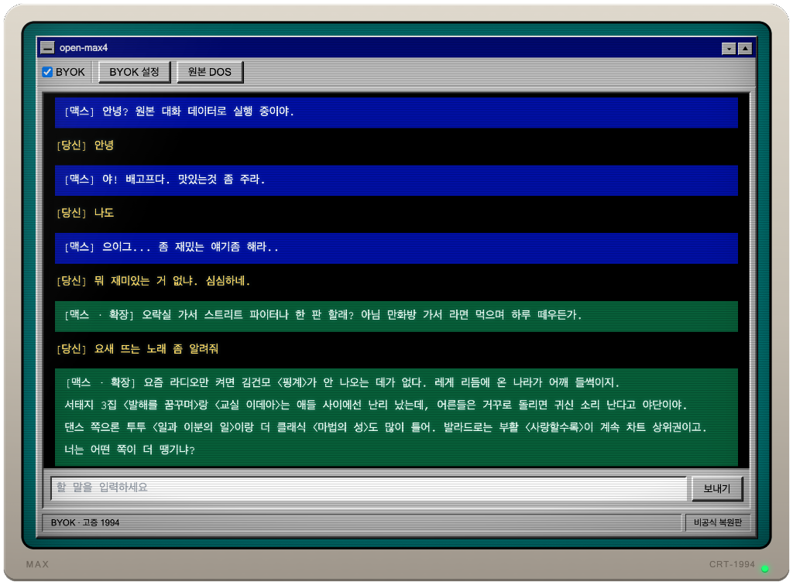

# MAX 4.00 — 웹 복원판

1994년 국내 PC통신 공개자료실에 올라왔던 도스용 대화 프로그램 **MAX 4.00**의 응답 엔진을 분석해 웹에서 다시 구현한 프로젝트입니다. 선택적으로 OpenAI 호환 LLM을 붙여 당시 지식만 아는 페르소나로 대화할 수 있습니다.



## 원저작물에 관하여

MAX는 **박정만** 님(당시 하이텔 ID `도용`)이 1993년부터 만든 프로그램입니다. MAX 1.0(1993)부터 맥스99까지 이어졌고, 하이텔·나우누리·천리안 공개자료실에서 배포되며 큰 인기를 얻었습니다.

**이 저장소는 원본 프로그램과 그 데이터 파일을 포함하지 않습니다.**
원저작물의 저작권은 원저작자에게 있으며, 이 프로젝트는 그와 무관한 비공식 복원 작업입니다. 실행하려면 사용자가 본인이 보유한 원본 사본을 직접 준비해야 합니다.

원저작자 또는 권리자께서 이 프로젝트에 이의가 있으시면 이슈로 알려주시면 즉시 내리겠습니다.

## 준비

원본 파일 일습을 `ref/max4/`에 둡니다.

```sh
mkdir -p ref/max4
# 보유한 원본 파일들을 ref/max4/ 에 복사
```

응답 데이터를 추출합니다.

```sh
mkdir -p web/public/local
python3 -m tools.extract_max4_data ref/max4 -o web/public/local/max4-pjm.json
```

도스 원본을 브라우저에서 그대로 돌리려면 js-dos 번들(`web/public/local/max4.jsdos`)을 직접 만들어 두어야 합니다. 없으면 `원본 DOS` 버튼만 동작하지 않고 나머지는 정상 동작합니다.

## 실행

```sh
npm install
npm run dev
```

Vite가 알려주는 주소로 접속합니다. 배포용 정적 파일은 `npm run build`로 `dist/`에 만듭니다.

> **`dist/`를 그대로 공개하지 마세요.** 빌드는 `web/public/`을 통째로 복사하므로,
> 준비해 둔 원본 사본(`web/public/local/`)이 산출물에 그대로 들어갑니다.
> 공개 배포하려면 그 디렉터리를 비우고 빌드하세요.

자세한 화면 설명과 BYOK 설정은 [web/README.md](web/README.md)를 보세요.

## 구성

| 경로 | 내용 |
|---|---|
| `web/src/App.svelte` | 화면 전체 — 창 크롬, 대화, 상태바, DOS 모드 |
| `web/src/Settings.svelte` | BYOK 설정 다이얼로그 |
| `web/src/lib/engine.ts` | 원본 응답 선택 로직 재구현 |
| `web/src/lib/byok.ts` | OpenAI 호환 요청 생성, 페르소나·고증 프롬프트 |
| `web/src/lib/era.ts` | 1990년대 고증 팩 검색 (연도 컷오프 + 키워드 매칭) |
| `web/src/lib/types.ts` | 카탈로그·고증 팩·BYOK 설정의 타입 정의 |
| `web/public/data/era-1990s.json` | 고증 팩 데이터 |
| `tools/extract_max4_data.py` | 원본 JOHAB 계열 데이터 추출기 |
| `docs/decode-notes.md` | 미해독 인코딩 분석 노트 |
| `docs/era-1990s.md` | 고증 팩 근거와 출처 |

## 테스트

```sh
npm test          # vitest — 엔진·고증·BYOK·마운트
npm run check     # svelte-check — 타입 검사
python3 -m unittest discover tests   # 추출기
```

원본 데이터가 없으면 그것을 필요로 하는 테스트는 자동으로 건너뜁니다.

## 라이선스와 제3자 구성요소

이 저장소의 코드와 문서는 [MIT 라이선스](LICENSE)입니다.
**원본 MAX 4.00에는 적용되지 않습니다!**

- [js-dos](https://js-dos.com) — GPL-2.0. 실행 시 공급자 CDN에서 불러오며 이 저장소가 번들·재배포하지 않습니다.
- [Svelte](https://svelte.dev) — MIT. [Vite](https://vite.dev) — MIT.

## 고지

- 이 프로젝트는 팬 복원물입니다. 원저작자·권리자와 아무런 제휴 관계가 없습니다.
- BYOK 모드에서 생성되는 응답은 **LLM이 만든 것이며 원저작자가 쓴 문장이 아닙니다.** 화면에서 `[맥스 · 확장]`으로 구분해 표시합니다.
- 고증 팩(`web/data/era-1990s.json`)은 공개된 사실 정보를 정리한 것으로, 출처는 `docs/era-1990s.md`에 있습니다. LLM이 실존 인물에 대해 부정확한 내용을 생성할 수 있으니 사실 확인 용도로 쓰지 마세요.
